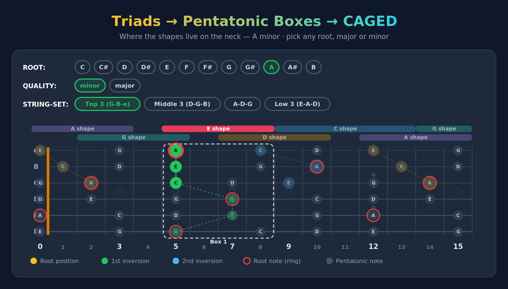

# Guitar: Triads → Pentatonic Boxes → CAGED

An interactive guitar-fretboard tool that shows how **triads**, **pentatonic boxes**, and the **CAGED system** are the same shapes viewed at different levels of detail — for any root note, in major, minor, augmented, or diminished.

It's a single self-contained `index.html` file: no build step, no dependencies, no network calls. Open it in a browser and it runs.

**Live demo:** https://alainbuyze.github.io/Guitar_Triads-Pentatonic-CAGED/

## What it shows

For a chosen key (any of the 12 roots × major/minor), on any of the four adjacent 3-string sets, the tool plots the three closed triad voicings (root, 1st, and 2nd inversion) and reveals, for each one:

- the **pentatonic box** it lives inside,
- the **CAGED shape** anchoring that box,
- the **full chord** — every chord tone of that shape across all six strings, traced with a dotted line (i.e. the barre chord the triad is part of).

The core idea: the **triad is the 3-note skeleton**, the **pentatonic box wraps two extra "safe" notes** around it, and the **CAGED barre chord is the full voicing** filling the same zone of the neck.

## Features

- **Root selector** — all 12 chromatic roots.
- **Quality toggle** — minor, major, augmented, or diminished (switches triad tones, pentatonic, and degree labels). Augmented and diminished triads don't map onto a standard CAGED shape or pentatonic scale, so for those two the pentatonic/CAGED overlay is hidden and only the three inversions (still fully clickable and playable) are shown.
- **String-set selector** — Top 3 (G-B-e), Middle 3 (D-G-B), A-D-G, Low 3 (E-A-D). Together these surface all five CAGED shapes.
- **Layer toggles** — pentatonic dots, CAGED shape bars, active box outline, full-chord overlay.
- **Label modes** — none, scale degrees (`1 b3 4 5 b7` / `1 2 3 5 6`), or note names.
- **Click any triad** to isolate it, brighten its CAGED bar, outline its box, and draw its full chord.
- Root notes are always ringed in red.
- **Audio** — click any note dot on the fretboard to hear its pitch, hit **Play** on a triad card to strum that voicing, or **Play full chord** (shown when a triad is selected) to strum the whole barre chord. Sound can be muted with the SOUND toggle. Tones are synthesized live in the browser (Karplus-Strong plucked-string algorithm via the Web Audio API) — no audio files, no dependencies.

## How it works

Everything is computed from music-theory first principles at render time — nothing is hard-coded per key:

1. **Pentatonic** = scale intervals above the root (`0 3 5 7 10` minor, `0 2 4 7 9` major) mapped onto standard tuning `E A D G B e`.
2. **Boxes** are built with an anchor-window method: for box *N*, the anchor is the *N*-th pentatonic degree on the low E string, and the box is every pentatonic note within a 4-fret window of that anchor. This reproduces the five standard positions and bounds each box cleanly.
3. **Triads** are found by brute-force search for compact voicings of the three chord tones on each string set, then each is assigned to the pentatonic box that contains all three of its notes (closest-centered box on boundaries).

### A note on box numbering in major keys

Pentatonic box numbers are anchored to the **shared pentatonic shape** — i.e. the relative minor — so a major key and its relative minor use the *same* box numbers (C-major pentatonic and A-minor pentatonic are the same shapes). The **CAGED shape** label, however, follows the actual chord. In major keys these two therefore sit **one position apart** (e.g. C major's E-shape barre lives in pentatonic box 2). The app calls this out in its "Connection" panel.

## Usage

Just open `index.html` in any modern browser — that's the whole app.

## Deployment (GitHub Pages)

This repo includes a GitHub Actions workflow ([`.github/workflows/deploy.yml`](.github/workflows/static.yml)) that **auto-deploys to GitHub Pages on every push to `main`**.

To turn it on once: **Settings → Pages → Build and deployment → Source: GitHub Actions**. After the next push, the site is live at the demo link above.

## License

MIT — see [LICENSE](LICENSE).
